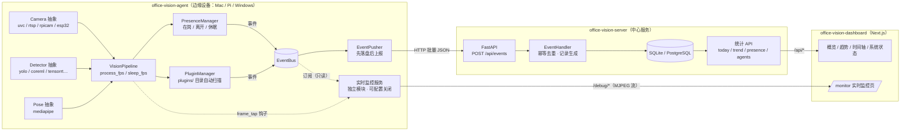
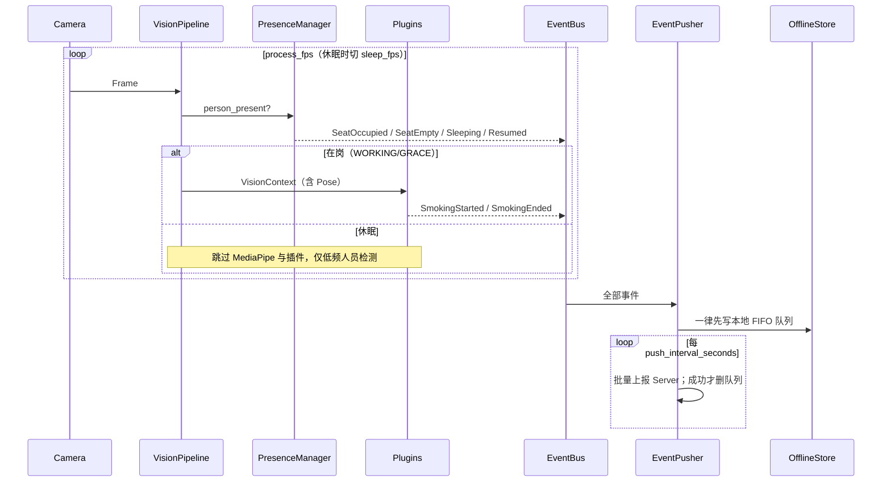
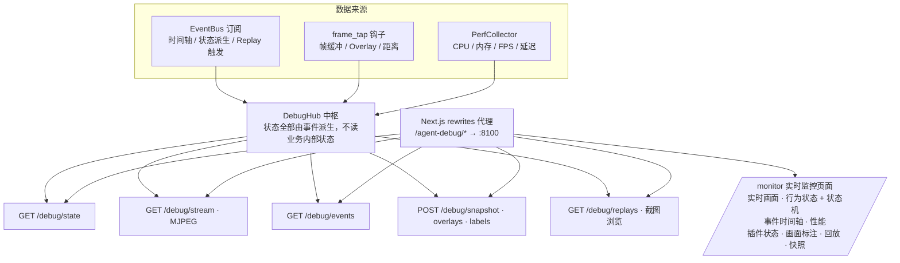

# Office Vision AI — 系统架构

> V1 架构文档。三个独立项目、事件驱动、插件化、平台无关。

## 一、总体架构



## 二、八条开发原则的落地位置

| 原则 | 落地 |
|---|---|
| ① Agent/Server 解耦 | Agent 只发事件（`EventPusher`），Server 只收事件（`EventHandler`）；Agent 不碰数据库，Server 不碰摄像头 |
| ② 行为识别插件化 | `plugins/<name>/plugin.py` 实现 `BaseBehaviorDetector` 即自动加载；抽烟插件采用夹烟手势 + 往返运动模式双重判定 |
| ③ AI 可替换 | `create_detector(type, config)` 工厂；yolo / coreml / tensorrt / openvino / tflite 枚举已预留 |
| ④ 配置驱动 | `config/agent.yaml` / `config/server.yaml` 唯一配置源；环境变量仅覆盖路径 |
| ⑤ 硬件抽象 | `create_camera(type, config)` 工厂；uvc / rtsp / rpicam / esp32 枚举已预留 |
| ⑥ 事件驱动 | 所有模块协作只经 `EventBus`；Presence→插件联动也走事件（PresenceSleeping/Resumed） |
| ⑦ 新增优先 | 实时监控、transport、监控 API 全部为新增模块，未改业务代码（仅管线加可选 frame_tap 钩子） |
| ⑧ 平台无关 | macOS 开发（UVC + Logitech）；树莓派换 `camera.type: rpicam` + `detector.type: tflite` 即可 |

## 三、Agent 内部数据流



**不丢不乱序保证**：事件先写 SQLite 队列再上报，失败保留重试；Server 按 `event_id` 幂等去重。

## 四、实时监控架构（Dashboard 正式功能）



关键约束（Spec 强制）：
- **独立模块**：`agent/debug/` 8 个文件，业务代码零调试逻辑；管线仅暴露可选 `frame_tap`（生产为 None 零开销）
- **只经 EventBus**：行为状态、插件状态、时间轴全部由事件派生
- **注册机制**：新插件放进 `plugins/` 后，`register_plugins(plugins.names, plugins.debug_infos)` 自动带入监控页，无需改实时监控
- **可关闭**：`debug.enabled=false` 时不装配 Hub、不启动 :8100 监控服务、不注入钩子
- **Event Replay**：SmokingStarted/Ended 触发，自动保存事件前 10s + 过程 + 后 10s（帧环形缓冲 30s）；不录视频，按间隔抽帧保存 JPEG 截图以节省磁盘
- **Label Mode**：接口已预留（`POST /debug/labels`），未来生成训练数据集

## 五、Server 数据模型

| 表 | 职责 | 关键约束 |
|---|---|---|
| `event_logs` | 全量事件流水 | `event_id` 唯一（幂等） |
| `smoking_records` | 抽烟记录 | `device_id + start_time` 唯一（重传不重复计数） |
| `agent_heartbeats` | 心跳与在线判定 | 60s 阈值 |

## 六、运行方式

```bash
# 1. Server（:8000）
cd office-vision-server && uv sync && uv run uvicorn server.main:app

# 2. Agent（需摄像头权限；debug 服务 :8100）
cd office-vision-agent && uv sync && uv run python scripts/download_models.py && uv run python -m agent.main

# 3. Dashboard（:3000，代理已配置）
cd office-vision-dashboard && npm run dev

# （可选）注入演示数据
cd office-vision-server && uv run python scripts/simulate_events.py
```

## 七、扩展路线图

- 新行为插件（喝水 / 玩手机）：新增 `plugins/<name>/`，实时监控自动展示
- 自训练模型：`yolo-training/` 独立项目负责采集→标注→训练，产出的 `best.pt` 配入
  `agent.yaml`（如 `detector.cigarette_weights`）部署回 Agent
- 新硬件：`camera/rtsp.py` 等实现 `BaseCamera` + 工厂注册一行
- 新 AI 后端：`detector/<engine>.py` 实现 `BaseDetector` + 工厂注册一行
- 多 Agent：Server 已按 `device_id` 维度隔离统计
- 自动化联动：`server/automation/`（Home Assistant）配置段已预留
